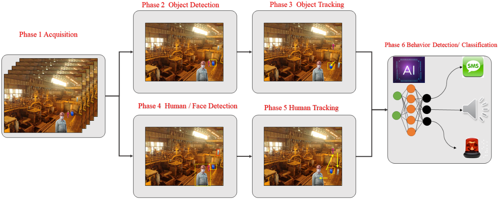
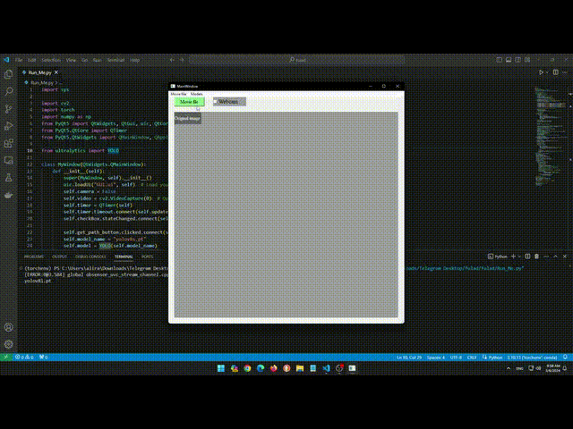

## Detection and Classification of High-Risk Personnel Behavior Using  YOLO

  
  
&nbsp;

  

    <b> </b>
    
      <a href="https:// ">
        <i>HOT</i>
      </a>
    
    &nbsp;&nbsp;&nbsp;&nbsp;
    <b>  platform</b>
    
      <a href="https://HamedAghapanah.com">
        <i>TRY IT OUT</i>
      </a>
    
  

  ##  Schmatic of basic GUI version 1.0.0

## Schmatic of improved GUI  version 2.0.0

   

    

    
  

  Detection and Classification of High-Risk Personnel Behavior Using  YOLO

This repository contains code and instructions for implementing cardiac localization using YOLO (You Only Look Once), a popular object detection algorithm.
## Table of Contents

    Introduction
    Requirements
    Installation
    Usage
    Training
    Testing
    Results
    License
    Acknowledgments

## Introduction

## Installation

## Results
